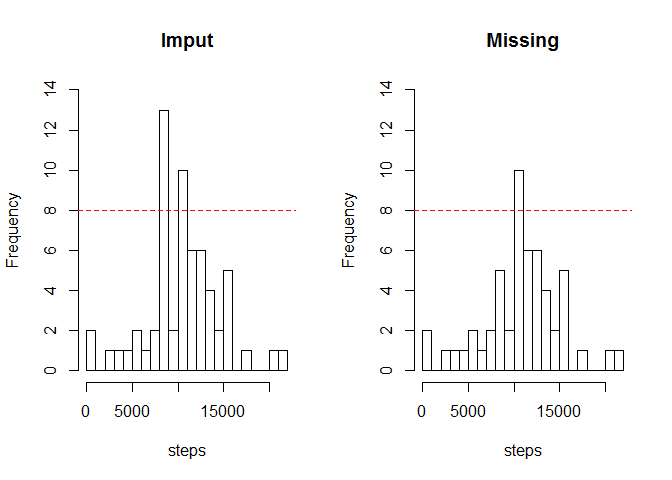

# Reproducible Research: Peer Assessment 1

  
## Loading and preprocessing the data  
Load csv data, and make data have a proper format.(1 & 2)


```r
library(dplyr)
```

```
## 
## Attaching package: 'dplyr'
## 
## The following objects are masked from 'package:stats':
## 
##     filter, lag
## 
## The following objects are masked from 'package:base':
## 
##     intersect, setdiff, setequal, union
```

```r
activity <- tbl_df(read.csv("activity.csv", colClasses=c("numeric","Date","numeric")))
```
  
## What is mean total number of steps taken per day?

1. Make dataset including total steps per each day using dplyr. 

```r
stepsPerDay <- activity %>% 
        filter(!is.na(steps)) %>% 
        group_by(date) %>% 
        summarise(steps = sum(steps))
```
  
2. Make a histogram of the total number of steps taken each day.  
The plot is set that binwidth is 1000, which means that frequency is counted by each 1000 step.


```r
library(ggplot2)
ggplot(stepsPerDay, aes(x=steps)) + geom_histogram(binwidth=1000)
```

 
  
3. Calculate and report the mean and median of the total number of steps taken per day.  
  
We can know that mean of the total number of step taken per day is

```r
round(mean(stepsPerDay$steps))
```

```
## [1] 10766
```
  
And median of that is

```r
median(stepsPerDay$steps)
```

```
## [1] 10765
```
  
## What is the average daily activity pattern?

1. Make a time series plot (i.e. type = "l") of the 5-minute interval (x-axis) and the average number of steps taken, averaged across all days (y-axis)

Constraint : Null data are removed.

```r
stepsIntv <- activity %>%          
        group_by(interval) %>% 
        summarise(steps = mean(steps, na.rm=TRUE))
qplot(interval, steps, data=stepsIntv, geom="line")
```

 
  
2. Which 5-minute interval, on average across all the days in the dataset, contains the maximum number of steps?

We can use max function.

```r
stepsIntv %>% 
        filter(steps == max(steps)) %>% 
        select(interval)
```

```
## Source: local data frame [1 x 1]
## 
##   interval
## 1      835
```
  
## Imputing missing values
1. Calculate and report the total number of missing values in the dataset (i.e. the total number of rows with NAs)

Certainly, each column date and interval has no NA.


```r
colSums(is.na(activity))
```

```
##    steps     date interval 
##     2304        0        0
```
  
2. Devise a strategy for filling in all of the missing values in the dataset. The strategy does not need to be sophisticated. For example, you could use the mean/median for that day, or the mean for that 5-minute interval, etc.

First, investigate distribution of NA by date.


```r
naStepsByDay <- 
        with(activity, 
                data.frame(
                        date=unique(date), 
                        naSteps= as.numeric(tapply(is.na(steps), date, mean))
                   )
        )             

# shows how many NAs are distributed on dates.
table(naStepsByDay$naSteps)
```

```
## 
##  0  1 
## 53  8
```
  
According to the above result, all of NAs are positioned on the specific date or not.   
Execpt the data consisting of NAs, conduct singular value decomposition.  
It enables us to extract a pricipal component, which is substitued for other NA data.  


```r
#extract the normal data without NA.
dates <- naStepsByDay[naStepsByDay$naSteps == 0,]$date

#constitute the matrix with daily activity pattern by column 
stepIntvMat <- activity[activity$date == dates[1],]$steps
for (i in 2:length(dates)){
        stepIntvMat <- cbind(stepIntvMat, activity[activity$date == dates[i],]$steps)
        }
dimnames(stepIntvMat) <- NULL

#singular value decomposition & plot the ratio of eigenvalues.
svdDStep <- svd(stepIntvMat)
plot(svdDStep$d / sum(svdDStep$d), ylab = "prop.")
```

 
  
Choose and make a principal contributor corresponding to first diagonal term.  
In addition, compare the principal contributor to one of normal data.


```r
# make the principal contributor
pcplSteps <- round(rowMeans(svdDStep$u[,1] %*% t(svdDStep$v[,1]) * svdDStep$d[1]))

# comparison between avg. and pricipal.
plot(pcplSteps, pch=19,col=2, ylab="steps")
points(rowMeans(stepIntvMat), col=4)
legend("topright",legend=c("principal","avg."),col=c(2,4), pch=c(19,1))
```

 
  
**Thus, I choose the strategy that NA data are set to the same as the principal contributor.**

  
3. Create a new dataset that is equal to the original dataset but with the missing data filled in.

Missing data is referred to the data frame, naStepsByDay, whose value is 1 at 2nd column. 


```r
# extract the date whose steps is consisting of missing data.
dates1 <- naStepsByDay[naStepsByDay$naSteps==1,]$date
newActivity <- activity  #make new one

#overwrite the principal contributor on missing data.
newActivity[newActivity$date %in% dates1,]$steps <- rep(pcplSteps,length(dates1))
colSums(is.na(newActivity))
```

```
##    steps     date interval 
##        0        0        0
```
newActivity is imputted data frame.
  
4. Make a histogram of the total number of steps taken each day and Calculate and report the mean and median total number of steps taken per day.  


```r
#total number of steps taken each day - new dataset
stepsPerDayNew <- newActivity %>% 
        group_by(date) %>% 
        summarise(steps = sum(steps))
#histogram
ggplot(stepsPerDayNew, aes(x=steps)) + geom_histogram(binwidth=1000)
```

 

```r
#mean
round(mean(stepsPerDayNew$steps))
```

```
## [1] 10479
```

```r
#median
median(stepsPerDayNew$steps)
```

```
## [1] 10395
```
  
Q1) Do these values differ from the estimates from the first part of the assignment?

Compare two histograms. Graph shows the difference of frequency,
adding 8 counts for 8000~9000 steps per day.

```r
par(mfrow=c(1,2))
#binwidth = 1000 : round(max(stepsPerDayNew$steps)/1000)
hist(stepsPerDayNew$steps, n=round(max(stepsPerDayNew$steps)/1000), xlab="steps",main = "Imput", ylim = c(0,14))
abline(8,0, lty = 2, col=2)
hist(stepsPerDay$steps, n=round(max(stepsPerDay$steps)/1000), xlab="steps", main = "Missing", ylim = c(0,14))
abline(8,0, lty = 2, col=2)
```

 
  
Mean and median are different from original one.

```r
#difference of mean between new and original.
round(mean(stepsPerDayNew$steps))-round(mean(stepsPerDay$steps))
```

```
## [1] -287
```

```r
#difference of median between new and original.
median(stepsPerDayNew$steps)-median(stepsPerDay$steps)
```

```
## [1] -370
```
  
Q2) What is the impact of imputing missing data on the estimates of the total daily number of steps?

New 8 data are added. It cannot escape affecting estimate summary such as mean, median, standard deviation and other numerical statistics, because the added data have own "biased" data and statistics.
  
## Are there differences in activity patterns between weekdays and weekends? 

1. Create a new factor variable in the dataset with two levels weekday and weekend indicating whether a given date is a weekday or weekend day.
  
Use format function with "%u", returning weekday as a decimal number (1~7, Monday is 1).  
Returned values are decimal so that they are helpful to categorize weekday or weekend.


```r
dayInd <- factor(as.numeric(format(newActivity$date, "%u"))<6)
levels(dayInd) <- c("weekend","weekday")
newActivity$day <- dayInd
```

  
2. Make a panel plot containing a time series plot (i.e. type = "l") of the 5-minute interval (x-axis) and the average number of steps taken, averaged across all weekday days or weekend days (y-axis). 

Regarding simulated example, utilize lattice package.

```r
library(lattice)
stepsByWeekday <- newActivity %>%
        group_by(interval, day) %>%
        summarise(steps=mean(steps))
#averaged steps across all weekday days or weekend days
xyplot(steps ~ interval | day, data=stepsByWeekday, type="l", xlab="Interval", ylab="Number of Steps", layout=c(1,2))
```

 


